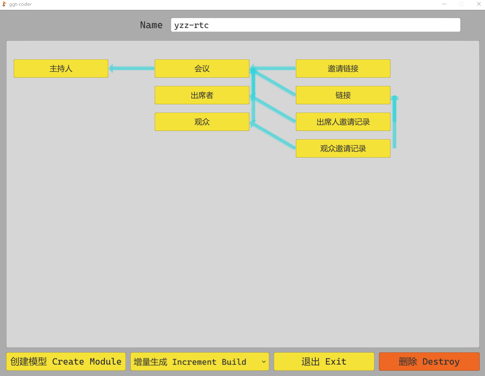
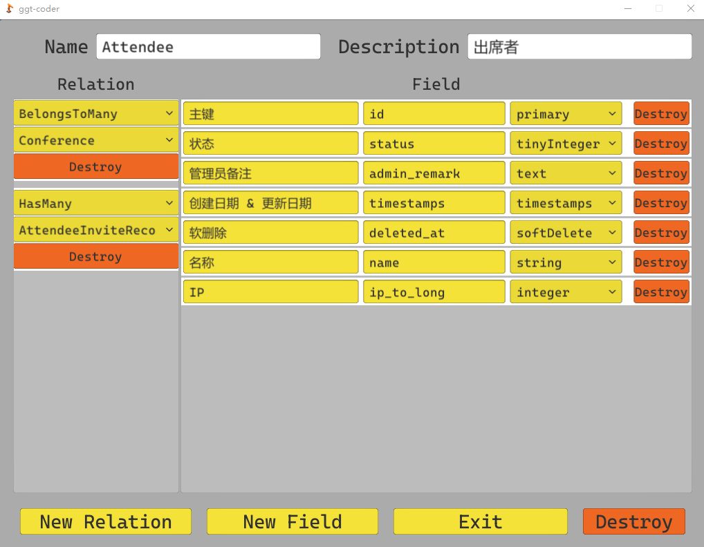

<h1 align="center">罐罐头 Coder</h1>

<h2 align="right">将你从流水线式的编程中解放出来</h2>

翻译:

* [English](../README.md)

## Features
* 可视化设计项目模型关系
* 一键生成项目
* 完整的 laravel 技术栈实现
* 根据字段设计，自动完成以下模块的编写，实现增删改查基础功能的全部流程，为复杂逻辑提供全面的对接空间
    * Model         - 模型文件
    * Observer      - 观察者
    * Resource      - API 资源
    * Collection    - 资源集合
    * Controller    - 控制器
    * Request       - 表单验证
    * Rule          - 表单规则
    * Policy        - 权限
    * Route
    * Migration
    * Seeder
    * Factory
    * Test
    * Docs

## Start

双击 ggt-coder.exe ，就像是打开一款游戏一样，享受编码的过程！

### 设置 Setting
#### 项目作者名称
* 将这一项改为你的名称，以后这个字段将会填入注释当中的 @author 里！
#### 编程语言
* 很抱歉目前仅支持 Laravel 8.12 ,目前修改这一栏不会产生任何效果，以后会加入 Go 语言的一键生成。欢迎其他小伙伴加入我们一起完成这个项目！
#### 模型关系类型
* 众所周知改需求是甲方的传统艺能。有次我在做一个项目，一开始的需求是`一个业务员维护一个合同`，他们的对应关系是 `Contract BelongsTo Salesman`。 
  这个项目上线运行了好久，甲方突然要我改成 `多个业务员维护一个合同`，他们的模型关系是 `Contract BelongsToMany Salesmen`。
  虽然只是换了一个单词，但是熟悉 `laravel 模型关联`的小伙伴已经知道了，这个改动涉及到新的数据表和多个字段的改动。
  而且甲方还要把合同和公司，联系人的关系由`多对一对多`改为`多对多对多`。
  甲方千不该万不该，甲方给我钱就是我的爸爸。所以出了问题我就要在自己身上反思：如果我在一开始就有一张中间表来`Middle`记录他们的关系，无论甲方怎么改，对我而言都是几个关键字的替换就可以了。 
* 所以就产生了这个`All For Middle`的设计理念。如果你无法适应这样的理念，可以将其改为`Real Relation`，`罐罐头`将忠实的为你生成你设计的模型关联。但我依旧建议你采用`All For Middle`的设计理念。
* 或许你认为多了一张中间表 `Middle`，我的项目“脏了”，它会变得更慢，我想要精益求精，我要设计最快的结构，哪怕以后要面对崩山一般的改动。但是`罐罐头`本就是为了`将你从流水线式的编程中解放出来`而存在的。相信我，省去这些时间去钻研新的技术，你的项目运行效率会取得千百倍的提升，而不是在一两微秒之间打转。
#### 默认字段
* 这些字段会在你创建模型的时候自动加入表中。
* 第一位是`字段描述`， 第二位是`字段名`，第三位是`字段类型`。前两个好理解，`字段类型`将会在之后详细说明，如果有必要的话，您完全可以凭借直觉自行决定修改默认字段。

### 项目列表 Project List
* 就是你的项目列表
* `罐罐头`的数据以`SQLite`的方式保存在本地，只要备份好数据库文件：`.\ggt-coder_Data\ggt-coder.db`，你就可以在任何地方完全重现属于你的`罐罐头`

### 项目详情 Project Content

* 在项目列表界面点击 `新项目` 或者之前创建的项目，都能进入这个界面。
* 顶部是项目名，建议采用像默认名称那样的 `英文单词 并用 - 连接`。因为域名解析更认可这种格式。
* 主要版面展示了这个项目中你设计的模型关系。模型关系以可视化的形式展示在这里，更好的梳理项目结构和设计思路。
* 你别管可视化做的好看不好看，它现在有个可视化的空间，以后就会有个更好的可视化的空间，对不对？
* 底部按钮分别是 `创建模型`,`完整生成：为你一键生成项目`,`退出`,`删除`

### 模型详情 Module Content

* 在项目详情页面点击`创建模型`或者之前创建的模型，都能进入这个界面。
* 顶部是模型名和模型说明，模型名建议采用大驼峰单数格式。因为`laravel`的模型名就是这个规矩。如果你不想遵守这个规矩，`罐罐头`会帮你守规矩。
* 主要版面列出了你对这个模型的设计。 
#### 模型关系
* 左侧六种模型关系分别是
  * BelongsTo
  * HasMany
  * BelongsToMany
  * HasOne
  * HasOneThrough
  * HasManyThrough
* 您只需要根据设计选择相应的对于关系即可，`罐罐头`会在生成项目的时候自动为您填充所需的字段，表格，对应方法。
* 当您在 `B` 模型中设计了 `B BelongsTo A `的时候，`罐罐头` 会自动为您在 `A` 模型中填入 `A HasMany B` 
#### 模型字段
* 右侧十三种字段类型分别是
  * integer: 常用于人数统计等情况下的正整数字段
  * integer-index: 常用于数字编号的带索引的正整数字段
  * string: 常用于名称的短字符串字段
  * string-index:  常用于帐户名的带索引的短字符字段
  * tinyInteger:   常用于状态码的枚举型字段
  * text: 常用于产品描述的长文章字段
  * storage: 仅用于图片类资源的 belongsTo Storage 字段。关于这个字段有必要在下方正式介绍一下。
  * decimal: 常用于金额的存在小数的字段
  * datetime: 常用于截止时间的日期型字段
  * array: 常用于规格等拥有不定项键值对的 json 字段
  * primary: 主键，请确保一个模型内唯一
  * timestamps: created_at 和 updated_at 的集合，建议一个模型内有且仅有一个此字段
  * softDelete: 软删除，自以为是的`罐罐头`将默认所有模型都是软删除，若不想采用软删除，请在 `app\Models\Model.php` 中自行修改
* 字段的内容不仅仅是设计了数据库内的字段，`罐罐头`还将为你在`factory`, `model`, `request` 等多个模块中制定相符的处理策略。详细区别恕无法在此一一描述。
* 字段名请采用下划线蛇形命名法。
* 现在您可以自行设计模型字段，来感受`罐罐头`一键生成项目带给您的愉悦体验。

#### storage
* 简介
  * storage 字段的逻辑
    * 前端从服务器中获得签名
    * 前端使用签名将图片类资源上传到`阿里云 OSS`服务当中
    * 前端将 资源id 填到字段中，将其保存到服务器
    * 在前端需求此资源的时候，后台生成一个带有签名的`OSS 服务临时地址`，前端去 `OSS` 服务器取得资源
  * storage 将流量上下行压力完全转移给 `OSS`，极高提升了响应速度，降低服务器对带宽的要求。
* 如何使用
  * 按注释将`阿里云OSS配置`填入`.env`当中。
  * 将项目中的`docs/project_api.yaml`文档交给前端。
  * 如果不够，就将 [阿里云OSS PostObject 官方文档](https://help.aliyun.com/document_detail/31988.html?spm=a2c4g.11186623.6.1690.31751c20qeGNUZ) 交给前端。
  * 如果还不够，就将项目中的 `vendor/iidestiny/laravel-filesystem-oss/README.md`。这里包含一个 CV 战士的专供demo
* 注意：
  * 服务器需要每隔一段时间将那些没有被使用到的 storage 清理掉来节约空间。它是通过定时任务实现的。所以你需要启动此项目的定时任务

~~~
export EDITOR=vi && crontab -e
~~~

此时进入 VI 编辑器界面：

* 按大写的 G （或者按方向键）将光标移动到最底端；
* 然后按键盘上的 『小写 i 键』进入 INSERT 模式；
* 黏贴下面这一行，并替换项目路径；
 ~~~
 * * * * * php 项目路径/artisan schedule:run >> /dev/null 2>&1
 ~~~
* 黏贴成功后按下键盘左上角的『ESC 键』进入 VI 的命令模式；
* 键盘输入 :wq 并敲击回车键保存退出。

## 完整创建
* 之前我们在设置页，项目详情，模型详情进行了那么多的操作，为的就是这一刻一键生成我们的项目。相信您一定已经等不及了吧。
* 点击项目详情页的`完整生成`,输入一个空路径，`罐罐头` 将为您创建上述所有的饼。现在，有了完成增删改查基础功能和完整空间的项目，将您的精力尽情的投入到 Coding 中去吧！
* 当项目生成过之后，就会转变为`增量生成`，即：根据你对模型的调整，在你的项目中做出对应的调整。很抱歉这一点还没有完成，不过它即将在下一版中到来。
* 项目中存在大量的 ` <------ some string` 的标记，它是为`增量生成`埋下的锚点。请勿修改本行内容，否则将导致`罐罐头`无法准确找到项目。
* Happy Coding !
* 感谢您的尝试，`罐罐头`将与您一同成长！